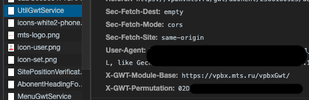
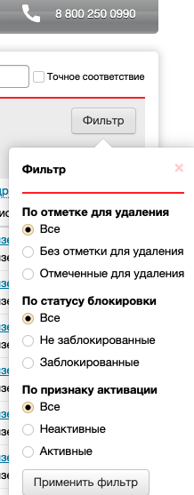
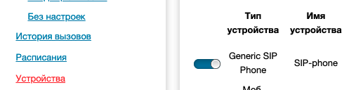
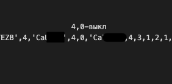

# Парсер данных из личного кабинета ВАТС МТС  

##### Парсер собирает данные о транках и их состоянии

Пример запроса:
```
from gwt_mts_parse.MtsVats import VATS

vats = VATS(address='vpbx.mts.ru', login='your_login', password='your_pass', x_gwt_permutation='your_token', contract_url_abonents='|-2|7|0|0|8|CaXXXX|0|8|{page}|8|Bk|0|')

vats.get_trunks()
```

## Общие разъяснения:

В личном кабинете Виртуальной АТС, МТС использует `GWT-RPC` - фреймворк который довольно необычно сериализует данные, так что немного информации с картинками:

*X-GWT-Permutation* - аналог XSRF_TOKEN, в первые встречается после логина, в одном из запросов к GWT:  
  

Любой запрос к GWT вам будет возвращать строку вида:
```
//OK[-4,0,14,18,17,16,15,-6,0,10,1,-7,0,0,0,6,0,0,5,-6,-5,1,-4,3,14,13...
```
Запросы к GWT в большей степени идут через PayLoad-запроса, примерный вид:
```
|0|6|https://vpbx.mts.ru/vpbxGwt/|EEBF75B777...
```

**Соответственно в данном API все запросы построены на разборе(парсинге) ответов, и изменении части запросов путем изменения PayLoad**

Некоторые моменты которые удалось выяснить:

> Перейдя на вкладку "Абоненты" из ЛК, или функцией `get_list_trunks()` в ответе будет много повторяющихся строк вида:  
> `CaXXXX',2,0,0,1,8,1,0,0,0,0,0,0 `  
> `CaXXXX` - по сути своей ссылка на объект сим-карты и если его добавить в PayLoad в нужное место,то мы получим данные по симкарте.  
> `2,0,0,1,8,1,0,0,0,0,0,0` - данный транк активирован, не помечен для удаления, и имеет рабочую привязку (по сути обычный рабочий транк)  
> `2,0,0,0,8,0,1,0,1,0,0,0` - данный транк выключен, помечен на удаление  

Параметр `contract_url_abonents` при создании VATS - это конец PayLoad, он указывается при запросе всех Абонентов(транков):

```
|{filter}|7|0|8|{CaXXXX}|0|8|{pagination}|8|{count_page}|0|
```  
>```filter``` - число (0, -1, -2) фильтр на возвращаемые значения, в веб-морде выглядит так:  
  
> ```CaXXXX``` - что-то вроде ссылки на вкладку "Абоненты"  
> ```pagination``` - пагинация 1стр - A, 2стр - B и т. д.  
> ```count_page``` - количество элементов на странице K - 10, Bk - 100  

*Позунок в транке можно передвигать запросами и отслеживать его:*


Для изменения состояния отправить запрос на адрес  
```
AbonentDeviceFormGwtService
```
Конец PayLoad ```CaXXXX|6|{bool}|``` - 1 - вкл, 0 - выкл

Также этот параметр передается в ответе по данному транку выглядит он так:



## Проблемы кода

1. Не меняется X-GWT-Permutation (возможно начнет меняться, и необходимо будет дорабатывать код)
2. Нет отслеживания состояния
3. Нет логгирования
4. mobilesip в атрибуты
5. Не всегда возвращаются все значения - проблема где то в реализации ассинхронности (не успевает вернуться ответ до запроса regexp)?
6. Решить вопрос с пагинацией
7. Доработать ассинхронность сделать ее более короче и лаконичней